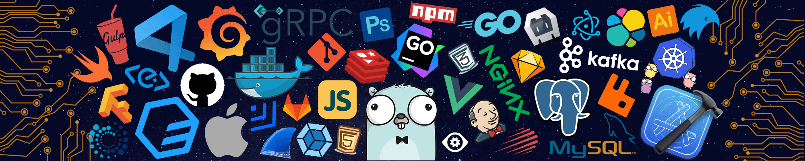

<!--   my-icons -->

    
    
    
    
    
       

<!--   my-header-img -->

&descAlign=79&fontAlign=50&descAlignY=70&fontColor=f7f5f5)

I'm a developer from <strong><a href="https://www.google.com/travel/things-to-do?dest_src=ut&dest_mid=%2Fm%2F0htfv">Tanzania</a></strong>. I'm working on ML projects and trying to learn new stuffs!

  
My Spotify Recently played

  

<h3>Quick Links</h3>

    
    

 

<ul>
<li>
💻Freelance Fullstack Developer <a href="https://www.coursera.org/articles/full-stack-developer">Fullstack </a>
</li>
    <li>
    🔭 I'm currently mastering <a href="https://www.python.org/events/python-user-group/1310/">ML</a>
    </li>
    <li>👨‍💻 Most of my projects here are based on Python.</li>
</ul>

<h2 id=lang>Skills</h2>

**Languages**

**Frameworks & Libraries**

**Data Science & ML**

**Databases**

**Tools**

**Cloud**

<h2>🤓Favorite Anime</h2>

 

<!-- 
  
 -->

<h2>Quote of the day</h2>

    
See the quote of today

    

<h2>☕️ I Need Coffee To Stay Alive. Yes I know, I'm That Dumb.</h2>

    

    

