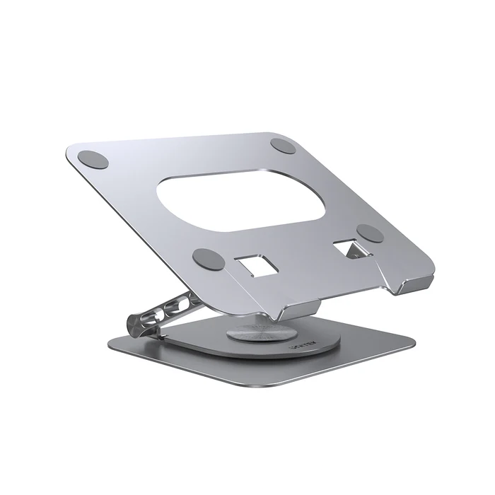

<!-- 

    

 -->

 

> [!IMPORTANT]
> 
> Hello 👋 I'm Shadrackovsky T. John, I am an aspiring young <strong>AI Researcher</strong> , <strong>Software and Data Engineer</strong> from Tanzania, doing Web Development, Machine Learning, and AI Integration. I didn't grow up with a computer in my room until my lovely grandmother bought me my first laptop (Second-hand Old Elitebook) when I joined college. I've built this journey fueled by long nights, insatiable curiosity, and a genuine love for understanding how things work.
> 

 

# obsessed with Karpathy, Ilya, LeCun, Bengio, Radford,  Georgi Gerganov.

<!-- ## 🚀 things i've built

 

<table>
<tr>
<td align="center" width="25%">

 <b><a href="https://github.com/zuck30/Malaika">Malaika</a></b>
 AI companion with memory, vision & voice. Inspired by <i>Her</i>. Now controls my MacBook.
</td>
<td align="center" width="25%">

 <b><a href="https://github.com/zuck30/kioni-ai-bro">Kioni</a></b>
 AI that speaks Swahili, English & Sheng with real cultural intelligence. Voice + vision.
</td>
<td align="center" width="25%">

 <b><a href="https://github.com/zuck30/mambo">Mambo</a></b>
 Dating app with AI conversation starters. Connect, Swipe, match, chat.
</td>
<td align="center" width="25%">

 <b><a href="https://github.com/zuck30/IoT-AI-Fertilizer-Recommendation">IoT Fertilizer AI</a></b>
 Real-time soil sensor data → ML recommendations. Built for maize farmers in Dodoma.
</td>
</tr>
<tr>
<td align="center" width="25%">

 <b><a href="https://github.com/zuck30/kazibox">Kaziboksi</a></b>
 Unified job & internship platform for Tanzania. AI job match, CV Parsing, Skill Gap analysis, market fit anaylis,CV maker, AI hiring,Tochi Mode SMS alerts for low-connectivity users.
</td>
<td align="center" width="25%">

 <b><a href="https://github.com/zuck30/sekela_pos">Sekela POS</a></b>
 Cloud-native POS with AI business analytics. Startup building for East African MSMEs.
</td>
<td align="center" width="25%">

 <b><a href="https://github.com/zuck30/afyachecker">AfyaChecker</a></b>
 Multilingual symptom checker (Swahili/English) with Groq API for real-time medical info.
</td>
<td align="center" width="25%">

 <b><a href="https://github.com/zuck30/aurafy">Aurafy</a></b>
 Spotify listening habits → personality profile. OAuth 2.0, Chart.js visualizations.
</td>
</tr>
<tr>
<td align="center" width="25%">

 <b><a href="https://github.com/zuck30/neural-network-studio">NNStudio</a></b>
 Watch a neural network train in 3D. Real-time. TensorFlow.js + Three.js.
</td>
<td align="center" width="25%">

 <b><a href="https://github.com/zuck30/RYOIKI-TENKAI">RYOIKI-TENKAI</a></b>
 16 JJK cursed techniques via hand gestures + Three.js particles.
 Create branded image cards for social media. <a href="https://zuck30.github.io/RYOIKI-TENKAI/">ryoiki-tenkai</a>
</td>
<td align="center" width="25%">

 <b><a href="https://github.com/zuck30/jenga3D">Jenga3D</a></b>
 Theory of Computation DFA, NFA, ε-NFA visualized in 3D. Because flat diagrams are boring.
</td>
<td align="center" width="25%">

 <b><a href="https://github.com/zuck30/university-finder">University Finder</a></b>
 30+ Tanzanian universities with ML-powered course matching recommendations.
</td>
</tr>
<tr>
<td align="center" width="25%">

 <b><a href="https://github.com/zuck30/chuodeep">Chuodeep</a></b>
 AI chat assistant for UDOM students. Academic info retrieval.
</td>
<td align="center" width="25%">

 <b><a href="https://github.com/zuck30/civegpt">CiveGpt</a></b>
 Chatbot app for CIVE/Informatics/UDOM students.
</td>
<td align="center" width="25%">

 <b><a href="https://github.com/zuck30/sura">Sura</a></b>
 Create branded image cards for social media. <a href="https://surabox.netlify.app">surabox.netlify.app</a>
</td>
<td align="center" width="25%">

 <b><a href="https://github.com/zuck30/bongo-anime-fit">Bongo Anime Fit</a></b>
 AI quiz that matches you with an anime character. Based.
</td>
</tr>
<tr>
<td align="center" width="25%">

 <b><a href="https://github.com/zuck30/garidesk-ai">Garidesk</a></b>
 Car & garage management system with AI business analytics. Client build.
</td>
<td align="center" width="25%">

 <b><a href="https://github.com/zuck30/sentinel-v1">Sentinel</a></b>
 Automated repo guardian. 9 cron schedules. GUI + CLI + web interface.
</td>
<td align="center" width="25%">

 <b><a href="https://github.com/zuck30/cash-transaction-risk">Cash Transaction Risk</a></b>
 Random Forest Classifier → Low/Medium/High risk cash transactions. Streamlit UI.
</td>
<td align="center" width="25%">

 <b><a href="https://github.com/zuck30/swahili-music-mood-classifier">Swahili Music Mood</a></b>
 ML classification for Swahili music by mood.
</td>
</tr>
</table>

 

  <a href="https://github.com/zuck30?tab=repositories">→ see all repositories on github ←</a>

  -->

# 🛠 technologies i use everyday

 

<!-- 

&nbsp;

  -->

<!-- 

&nbsp;

 -->

 

# 🧠 roadmap I'm focusing

| Area | What I'm mastering |
|------|---------------------|
| **GenAI & LLMs** | Fine-tuning (LoRA/QLoRA), RAG systems, Chroma vector DB, Hugging Face |
| **Python & Data** | FastAPI, Pandas, NumPy, PyTorch, AI models and Large Dataset Trainings |
| **Data Engineering** | SQL, data cleaning, pipelining, API integration |
| **Cloud & DevOps** | Docker, Git, Linux, Render, Netlify, Vercel |
| **Frontend** | React, Next, Vite, Tailwind CSS, shadcn-ui |
| **Backend & IoT** | Supabase, Python, Agriculture Projects that involves ioT and Cloud |

# 💻 my framework
> [!IMPORTANT]
>I'm a Self taught Software Engineer, I watch tons of YouTube or Pirated Tutorials and practise, practise to build new skills.

 

# 🎮 my desk setup

<table>
<tr>
<td align="center" width="14%"> <b>M3 MacBook Pro</b> 14" · 1TB</td>
<td align="center" width="14%"> <b>Monitor Lightbar</b> Lymax L1 Plus</td>
<td align="center" width="14%"> <b>Vertical Stand</b> Vaydeer dock</td>
<td align="center" width="14%"> <b>360° Stand</b> Multi-angle</td>
<td align="center" width="14%"> <b>Anti-blue ray</b> Eye protection</td>
<td align="center" width="14%"> <b>Neckband</b> Lenovo HE05X</td>
<td align="center" width="14%"> <b>Chessboard</b> Focus and Strategic breaks</td>
</tr>
<tr>
<td align="center" width="14%"> <b>Microfiber</b> Screen cleaning</td>
<td align="center" width="14%"> <b>Desk Organizer</b> Mesh holder</td>
<td align="center" width="14%"> <b>Logitech G213</b> Keyboard</td>
<td align="center" width="14%"> <b>34" Curved</b> UHD Monitor</td>
<td align="center" width="14%"> <b>Wooden Shelf</b> Desk shelf</td>
<td align="center" width="14%"> <b>The Broken Wings</b> Kahlil Gibran</td>
<td align="center" width="14%"> <b>Island</b> Aldous Huxley</td>
<td align="center" width="14%"> <b>Rubber Duck</b> debugging</td>
</tr>
</table>

# 🤝 currently looking for

>[!IMPORTANT]
>Open for freelance contracts in AI/ML and Full-Stack, open-source AI collaborations, remote engineering roles, and investor funding.

# 🎸 thing i love the most

  

# 🚀 hire me
>[!IMPORTANT]
>mwalyangashadrack@gmail.com

